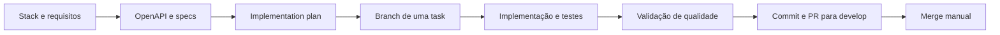

# Task Manager

Aplicação full stack para gerenciar tarefas com criação, listagem, edição inline, conclusão e exclusão. O projeto combina uma API REST em Spring Boot com uma interface React responsiva, acessível e em dark mode.

## Funcionalidades

- Criar e listar tarefas.
- Editar o título de uma tarefa existente.
- Alternar uma tarefa entre pendente e concluída.
- Excluir tarefas.
- Validar títulos entre 3 e 100 caracteres.
- Exibir estados de carregamento, lista vazia e erros da API.
- Operar em layouts desktop e mobile com suporte a teclado e tecnologias assistivas.

## Arquitetura e stack

```text
React 19 + TypeScript + Vite
              │
              │ HTTP /api
              ▼
Spring Boot 4.1 + Java 21
              │
              ▼
       Spring Data JPA + H2
```

| Camada | Tecnologias principais |
| --- | --- |
| Backend | Java 21, Spring Boot, Spring Web, Validation, Data JPA, H2 e springdoc-openapi |
| Frontend | React 19, TypeScript, Vite, Axios e Tailwind CSS |
| Testes | JUnit, Mockito, AssertJ, MockMvc, Vitest, Testing Library e Playwright |

Mais detalhes estão em [`stack.md`](stack.md) e na [especificação de arquitetura](specs/1-architecture-spec.md).

## Como executar

### Pré-requisitos

- Java 21.
- Maven 3.9 ou compatível.
- Node.js e npm compatíveis com o `package-lock.json`.
- Firefox do Playwright, somente para os testes E2E.

Na raiz do projeto, crie o arquivo local de ambiente:

```powershell
Copy-Item .env.example .env
```

Para executar a aplicação, somente estas variáveis do `.env.example` são relevantes:

| Variável | Padrão | Finalidade |
| --- | --- | --- |
| `SERVER_PORT` | `8080` | Porta da API |
| `CORS_ALLOWED_ORIGINS` | `http://localhost:5173` | Origens liberadas pelo backend |
| `VITE_API_BASE_URL` | vazio | URL direta opcional da API; vazio usa o proxy do Vite |
| `VITE_BACKEND_PROXY_TARGET` | `http://localhost:8080` | Destino do proxy `/api` em desenvolvimento |
| `VITE_DEV_SERVER_HOST` | `127.0.0.1` | Host local usado pelo frontend e Playwright |
| `VITE_DEV_SERVER_PORT` | `5173` | Porta local do frontend |
| `PLAYWRIGHT_BASE_URL` | `http://127.0.0.1:5173` | URL dos testes E2E |

As demais variáveis do `.env.example` pertencem ao template e às integrações opcionais do AIOX. Elas não são necessárias para executar o Task Manager. O arquivo `.env` está ignorado pelo Git e não deve ser versionado.

Inicie o backend em um terminal:

```powershell
cd backend
mvn spring-boot:run
```

Em outro terminal, inicie o frontend:

```powershell
cd frontend
npm install
npm run dev
```

A interface ficará disponível em `http://localhost:5173`. Com a API ativa, a documentação gerada pelo springdoc pode ser acessada em `http://localhost:8080/swagger-ui.html` e `http://localhost:8080/v3/api-docs`.

## Contrato da API

O arquivo [`openapi.yaml`](openapi.yaml) é o contrato canônico da API.

| Método | Endpoint | Resultado de sucesso |
| --- | --- | --- |
| `GET` | `/api/tasks` | Lista as tarefas (`200`) |
| `POST` | `/api/tasks` | Cria uma tarefa (`201`) |
| `PUT` | `/api/tasks/{id}` | Atualiza o título (`200`) |
| `PATCH` | `/api/tasks/{id}/toggle` | Alterna o status (`200`) |
| `DELETE` | `/api/tasks/{id}` | Exclui a tarefa (`204`) |

Erros de validação, recursos inexistentes e falhas inesperadas seguem `application/problem+json`, conforme o contrato.

## Testes e quality gates

Backend:

```powershell
cd backend
mvn test
```

Frontend:

```powershell
cd frontend
npm test -- --run
npm run lint
npm run build
```

E2E em Firefox desktop e viewport mobile:

```powershell
cd frontend
npx playwright install firefox
npm run test:e2e
```

O backend deve estar ativo para a jornada integrada. A estratégia, os cenários e os critérios de aceite estão em [`specs/3-testing-strategy.md`](specs/3-testing-strategy.md) e [`specs/5-acceptance-matrix.md`](specs/5-acceptance-matrix.md).

## Estratégia Spec-Driven

O desenvolvimento começou pelos artefatos de especificação. O código foi implementado depois que contrato, arquitetura, experiência e critérios de aceite já estavam descritos.



Cada item foi entregue isoladamente em uma branch `feature/task-{número}-{slug}`. Antes de iniciar a próxima task, o merge da anterior em `develop` era confirmado no remoto. Ao terminar, eram executados os testes proporcionais à camada alterada, seguido de commit atômico, push, Pull Request e merge manual.

### Artefatos de especificação e rastreamento

| Artefato | Localização | Responsabilidade |
| --- | --- | --- |
| Stack | [`stack.md`](stack.md) | Tecnologias e separação entre backend e frontend |
| Contrato REST | [`openapi.yaml`](openapi.yaml) | Fonte canônica dos endpoints, DTOs e respostas |
| Arquitetura | [`specs/1-architecture-spec.md`](specs/1-architecture-spec.md) | Camadas, componentes e decisões estruturais |
| Estratégia de testes | [`specs/3-testing-strategy.md`](specs/3-testing-strategy.md) | Pirâmide, ferramentas e cenários obrigatórios |
| UI/UX | [`specs/4-ui-ux-spec.md`](specs/4-ui-ux-spec.md) | Layout, tema, estados e acessibilidade |
| Matriz de aceite | [`specs/5-acceptance-matrix.md`](specs/5-acceptance-matrix.md) | Rastreabilidade entre requisitos e validações |
| Plano de implementação | [`implementation-plan.md`](implementation-plan.md) | Fases, tasks e cobertura esperada |
| Relatório de acessibilidade | [`docs/qa/task-32-accessibility-report.md`](docs/qa/task-32-accessibility-report.md) | Evidências da auditoria WCAG 2.1 AA |

## Agents, skills e fluxo do projeto

As instruções automáticas do repositório estão em [`AGENTS.md`](AGENTS.md). Esse arquivo conecta as regras do AIOX ao fluxo específico deste projeto.

### Skill específica do projeto

A skill canônica [`task-delivery-flow`](.agents/skills/task-delivery-flow/SKILL.md) automatiza o ciclo usado para cada task:

1. Verificar no remoto o merge da task anterior.
2. Atualizar `develop` e criar uma branch `feature/task-{número}-{slug}`.
3. Implementar apenas a task atual.
4. Executar os testes da camada alterada.
5. Criar um commit atômico e delegar push/PR ao papel `devops`.
6. Aguardar o merge manual antes de iniciar outra task.

Ela fica em `.agents/` porque é uma regra local e reutilizável deste repositório. As pastas `.codex/skills/` e `.codex/agents/` contêm projeções/ativadores do AIOX para o Codex, não são a fonte canônica dessa skill de entrega.

### Agents disponíveis

O AIOX instalou definições para os papéis `aiox-master`, `analyst`, `architect`, `data-engineer`, `dev`, `devops`, `pm`, `po`, `qa`, `sm`, `squad-creator` e `ux-design-expert`. As definições canônicas ficam em `.aiox-core/development/agents/`, enquanto as projeções para este ambiente ficam em `.codex/agents/` e `.codex/skills/`.

No fluxo efetivamente adotado neste projeto, as responsabilidades centrais foram:

| Papel | Responsabilidade |
| --- | --- |
| `dev` | Implementação restrita à task atual |
| `qa` | Testes, auditorias e veredito de qualidade |
| `devops` | Autoridade exclusiva para push e criação de Pull Request |
| Usuário | Merge manual e autorização para seguir à próxima task |

A separação de autoridades está definida na [Constitution do AIOX](.aiox-core/constitution.md).

## Como o AIOX foi utilizado

O AIOX serviu como camada de governança e organização do desenvolvimento. Ele forneceu a Constitution, as definições de agentes, regras de autoridade, quality gates, templates, checklists, tasks e workflows que orientaram o trabalho. Sobre essa base foi criada a skill `task-delivery-flow`, adaptando o processo às entregas numeradas do `implementation-plan.md`.

O uso foi intencionalmente mais leve do que o ciclo AIOX completo:

- Não existe um squad personalizado do Task Manager: o caminho `squads/` está configurado em `.aiox-core/core-config.yaml`, mas não há diretório `squads/` nem manifesto `squad.yaml` neste repositório.
- `.aiox-core/` contém o framework instalado e seus artefatos gerais; não representa um squad específico deste domínio.
- `.codex/` contém projeções e ativadores para usar os agents e skills do framework no Codex.
- Não foram adotados integralmente `docs/stories/`, handoffs formais ou o arquivo local `.aiox/project-status.yaml`.
- O MCP do AIOX está desativado na configuração atual.
- As skills gerais em `.aiox-core/development/skills/` permanecem disponíveis, mas o processo recorrente e comprovado do projeto está concentrado em `AGENTS.md`, na skill local e no plano de implementação.

Portanto, o AIOX foi usado corretamente como estrutura de governança, ainda que não como um squad completo. Criar um squad retroativamente não acrescentaria valor ao produto final; faria sentido apenas se esses agents, workflows e templates específicos do Task Manager fossem reutilizados em outros projetos.

## Estrutura relevante

```text
task-manager/
├── .agents/skills/task-delivery-flow/  # fluxo específico das tasks
├── .aiox-core/                         # framework, Constitution e agents canônicos
├── .codex/                             # projeções do AIOX para o Codex
├── backend/                            # API Spring Boot
├── frontend/                           # interface React e testes E2E
├── docs/qa/                            # evidências de QA
├── specs/                              # especificações do produto
├── AGENTS.md                           # instruções automáticas do repositório
├── implementation-plan.md              # rastreamento das tasks
├── openapi.yaml                        # contrato canônico da API
└── stack.md                            # visão tecnológica
```
